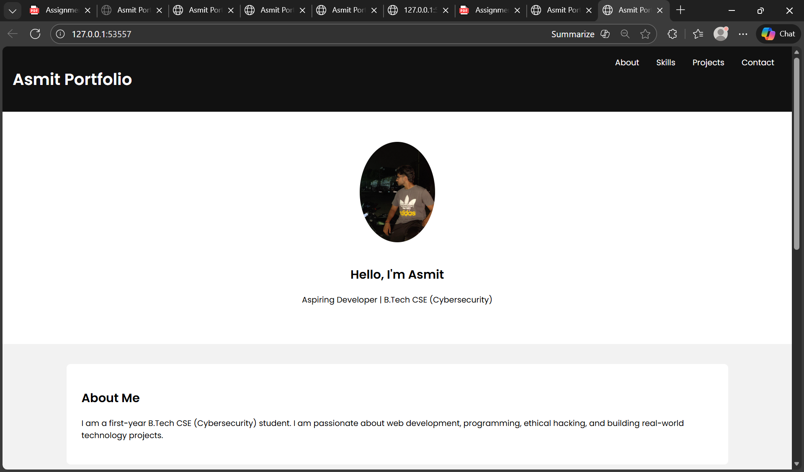
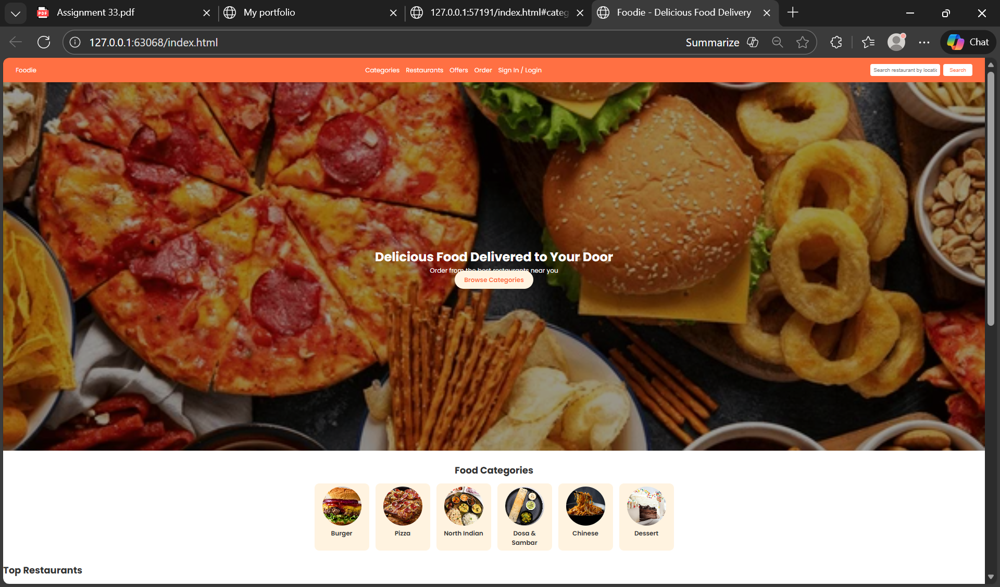
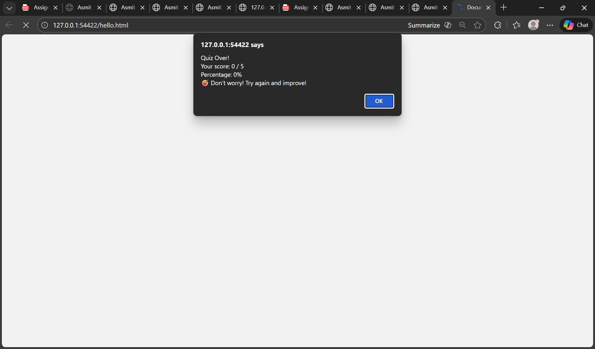

# Asmit Portfolio Website

## Projects
1. Portfolio Website — Responsive site with About, Skills, Projects, Contact.
2. Food Delivery App — Modern food ordering site with menu and categories.
3. Quiz Game — Simple JavaScript quiz in the browser console.

## How to Run
Open `index.html` in a browser.

## Features
- Responsive design
- Interactive elements
- Showcase of multiple projects

## How to Use
1. Clone the repository
2. Open `index.html` in a web browser
3. Explore the projects section
   ## Projects

### Project 1 — Portfolio Website
A static webpage showcasing my skills and projects.

### Project 2 — Food Delivery App
A responsive web application.

### Project 3 — Quiz Game
A simple interactive quiz game.

BY : ASMIT
